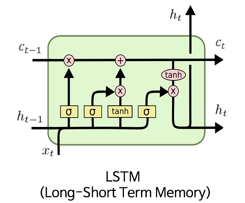

# FIN 556 Group 1 Project

## Team Members

- Ruipeng Han - ruipeng2@illinois.edu
- Yihong Jian - yihongj2@illinois.edu
- Tomoyoshi Kimura - tkimura4@illinois.edu (Team Leader)
- Kaiyuan Luo - kaiyuan8@illinois.edu


## Project Description

We will implement HFT strategies that trade on real-world market data using proprietary software Strategy Studio (SS). This project has several components: market data, strategy, analysis, and automation. The first component is **data parser**. Since SS does not have built-in data, we need to harvest our own for backtesting. Therefore, we will be downloading historic market data from IEX. The second component is the **strategy development**--implement trading strategies and backtest the strategies in SS. We are going to implement a few strategies for this project, ***Kalman Filter***, ***Reinforcement Learning***, and ***Long short term memory*** . The next component will be interpreting the output of SS. SS will generate complex CSV files containing trade histories and earnings. Since the CSVs do not provide much explicitly, we will interpret them and analyze the strategies' performance, generating comparisons and visualizations. The final component is automation. Since running SS backtesting requires users to type many lines of commands, we feel the need to write a script to replace the manual work. Ideally, we should be able to run the backtesting in one click.

## Project Outline

- IEX data parser
  - We are using data parser provided by Professor David Lariviere to parse SPY data
- Strategies
  - Kalman Filter Strategy
  - Reinforcement Learning Strategy
  - LSTM (back up)
- Analysis
  - Strategy Profit and Loss
  - Strategy output comparison
- [Report](/Final Report.md) (inside `./docs`)
- [Video Link](https://uofi.box.com/s/yexq0kiet8z1xossiecjcre2a89hj7fv)

```bash
.
├── Final Report.md
├── README.md
├── analysis
│   ├── analysis_documentation.md
│   ├── compare_strategy.py
│   ├── intra.ipynb
│   ├── main.py
│   ├── sample_data
│   │   └── ...csv
│   ├── sample_main.py
│   └── strategy_analysis.py
├── assets
│   └── ...png
├── compile_and_backtest.sh
├── get_torch.sh
├── iexdownloaderparser
├── quant
│   ├── kalman
│   │   ├── figures
│   │   │   └── ...png
│   │   └── kalman_measure.py
│   ├── quant_measure.md
│   ├── requirements.txt
│   └── risk_measure
│       └── risk_measure.py
├── requirements.txt
└── strategies
    ├── kalman_filter
    │   ├── KalmanFilterStrategy.cpp
    │   ├── KalmanFilterStrategy.h
    │   ├── Makefile
    │   ├── kalman_filter.cpp
    │   └── kalman_filter.h
    ├── lstm
    │   ├── LSTMStrategy.cpp
    │   ├── LSTMStrategy.h
    │   ├── Makefile
    │   └── lstm.ipynb
    └── simple_torch
        ├── Makefile
        ├── TorchStrategy.cpp
        └── TorchStrategy.h
```

## Dependencies
- LibTorch (with CXX11 ABI)
- Eigen
- Strategy Studio

## Usage

### IEX Data Parser

#### Parser outline

- We directly imported Professor's IEX downloader/parser as a submodule of our project so we can conveniently retrive IEX data.
- This parser downloads and parses IEX DEEP and trade data into the "Depth Update By Price" and "Trade Message" format in Strategy Studio, respectively. 
- The original repository can be found <ins>[here](https://gitlab.engr.illinois.edu/shared_code/iexdownloaderparser)</ins>.

#### Steps

1. Direct to the IexDownloaderParser directory `cd iexdownloaderparser/`and run `./download.sh` to download the source IEX deep data (.gz format). To retrieve data in a specific range of dates, open and edit the download.sh, only modifies the start-date and end-date arguments:

   ```bash
   python3 src/download_iex_pcaps.py --start-date 2021-11-15 --end-date 2021-11-16 --download-dir data/iex_downloads
   ```

   Note that git-submodules need to be pulled separately, detailed instruction for pulling git-submodule can be found [here](https://stackoverflow.com/questions/1030169/easy-way-to-pull-latest-of-all-git-submodules)

2. Check that the downloaded raw IEX DEEP dat files should be stored at `iexdownloaderparsers/data/iex_downlaods/DEEP`

3. Run `./parse_all.sh` to parse IEX deep data. Result will be stored under `iexdownloaderparsers/data/text_tick_data` with the foramt `tick_SYMBOL_YYYYMMDD.txt.gz`.  

   To specify the company symbols, edit the `--symbols` argument in `parse_all.sh`. The default is SPY only. You can add more companys:

   ```bash
   gunzip -d -c $pcap | tcpdump -r - -w - -s 0 | $PYTHON_INTERP src/parse_iex_pcap.py /dev/stdin --symbols SPY,APPL,GOOG,QQQ --trade-date $pcap_date --output-deep-books-too
   ```

4. The parsed data is in `.gz` format. We want to extract it and save it to a `.txt` file which can be feed into Strategy Studio. Run the following command under `iexdownloaderparsers/data/text_tick_data`  ***(please change your symbol and dates accordingly)***:

   ```bash
   gunzip -d -c tick_SPY_20171218.txt.gz | awk -F',' '$4 == "P" {print $0}' > tick_SPY_20171218.txt
   ```

   This command extracts the data and rows where the fourth column is "P", which corresponds to the format of "Depth Update By Price (OrderBook data)" in Strategy Studio. 

   If instead you want to retrive only the trade data, simply change "P" to "T" in the above command, which is following:

   ```bash
   gunzip -d -c tick_SPY_20171218.txt.gz | awk -F',' '$4 == "T" {print $0}' > tick_SPY_20171218.txt
   ```

5. The `tick_SPY_20171218.txt` (*or your custom data file*) is ready to feed in SS.

### Strategy Studio

- Strategies will be implemented by extending StrategyStudio::Strategy interface using C++. In this way, we can compile binaries for SS to backtest.
  - C++
  - Strategy Studio

#### Kalman Filter Strategy

- This is a Kalman Filter based trading strategy. Kalman filter is a common technic for signal processing. It introduces random variances to deduce to potential locations of a projectile. We hope that it could also capture the movements in between trades and profit from it.
```math
\mathbf{x'} = \mathbf{A} \mathbf{x} + \mathbf{B} \mathbf{u} + \mathbf{w}
```

#### LSTM Strategy

- We also implemented a LSTM model using Python, which is exported as a .pt model then loaded and backtested in Strategy Studio.
In high-frequency trading (HFT), LSTM models can be used to analyze and make predictions based on financial time series data, such as stock prices, volumes, and order flows. HFT firms often use LSTMs to build predictive models that can identify patterns in the data and make trades based on those patterns. In our project, we used LSTM to predict the market price of the given stock for the next trade; if the predicted price is higher, we will initiate a BUY action in StrategyStudio, else, we will sell.

<p align="center">
  
</p>

- The technology involved is:
  * Python and Google Colab: The LSTM model is implemented in Python and trained locally.
  * Strategy Studio: We load the Python-trained model ("lstm.pt") in C++ using LibTorch library (a C++ distribution for Pytorch), and we run inference on the model on each trade callback (`OnTrade()`). The model will yield a result, from which we will leverage to make further decisions.

```math
\mathbf{i}t = \sigma(\mathbf{W}{ix} \mathbf{x}t + \mathbf{W}{ih} \mathbf{h}_{t-1} + \mathbf{b}_i) \\
\mathbf{f}t = \sigma(\mathbf{W}{fx} \mathbf{x}t + \mathbf{W}{fh} \mathbf{h}_{t-1} + \mathbf{b}_f) \\
\mathbf{o}t = \sigma(\mathbf{W}{ox} \mathbf{x}t + \mathbf{W}{oh} \mathbf{h}_{t-1} + \mathbf{b}_o) \\ 
\mathbf{g}t = \tanh(\mathbf{W}{gx} \mathbf{x}t + \mathbf{W}{gh} \mathbf{h}_{t-1} + \mathbf{b}_g) \\
\mathbf{c}_t = \mathbf{f}t \odot \mathbf{c}{t-1} + \mathbf{i}_t \odot \mathbf{g}_t \\
\mathbf{h}_t = \mathbf{o}_t \odot \tanh(\mathbf{c}_t)
```

- where $`\mathbf{i}t`$, $`\mathbf{f}t`$, $`\mathbf{o}t`$, and $`\mathbf{g}t`$ are the input, forget, output, and cell activation gates, respectively; $`\mathbf{c}t`$ is the cell state; $`\mathbf{h}t`$ is the output of the LSTM unit at time $t$; $`\mathbf{x}t`$ is the input at time $t$; $`\mathbf{W}{ix}`$, $`\mathbf{W}{fx}`$, $`\mathbf{W}{ox}`$, and $`\mathbf{W}{gx}`$ are the input-to-input gate, input-to-forget gate, input-to-output gate, and input-to-cell activation gate weight matrices, respectively; $`\mathbf{W}{ih}`$, $`\mathbf{W}{fh}`$, $`\mathbf{W}{oh}`$, and $`\mathbf{W}_{gh}`$ are the hidden-to-input gate, hidden-to-forget gate, hidden-to-output gate, and hidden-to-cell activation gate weight matrices.


#### Strategy Usage

- Move these files (`.cpp, .h, Makefile`) into Strategy Studios
- We have provided the script file `compile_backtest.sh` that compiles the strategy, moves the strategy output file to the desired location in Strategy Studio, and start the backtest command line in Strategy Studio. 
- When Strategy Studio finishes backtesting, our script would then export these files into `.csv` files. 

##### Torch Usage

- We also provided a script file `get_torch.sh` to get torch into strategy studio. 
- We have also implemented a simple torch strategy `strategies/simple_torch` that does nothing but test torch compilation.

### Analysis

***Setup***
```
pip install -r requirements.txt
```

#### Analysis & Visualization Description

- For analysis, we would like to know the statistics of our strategy. There are various metrics that we would like to evaluate on our result. Strategy Studio outputs three files: fills, orders, and PnL (Profit and Loss). For analysis, we would mainly focus on PnL since the net loss is what we care about the most as traders.

- The PnL file generated is a `.csv` file with three columns: Strategy name, Time, and Cumulative PnL. For interpretation, we would analyze the PnL based on several metrics. 

  - Maximum Profit and Loss

    

  - Minimum Profit and Loss

    

  - Net Profit and Loss

    

  - Cumulative Returns

    

  - Sharpe Ratio

    

  - Max Drowndown

    


- For visualization, we would like to visualize the Profit and Loss against Time, as well as a comparison with the Tick data.

#### Analysis & Visualization Usage

- Direct to `analysis` directory (`cd ./analysis`)
- `cd ./analysis`
- `python3 main.py` would run visualization by using the latest three files (Fill, Order, and PnL). This will generate figures and store in `./figs/` directory. 
- There is also an interactive version by runing `python3 main.py -i` and follows the promot.
  - Interactive mode would ask you to add strategy by entering the 
    - `Name` of the strategy
    - `ID` of the strategy output if the strategy is ran multiple times
    - `Ticks` of the strategy, or the symbol, for example:`SPY` 
  - When we enter no for adding strategy, the interactive mode would also outputs the **measurement table** with each strategy statistics as a column

## Evaluation & Goal:

- Clarity & understandability
  - Document process and week meetings
  - Codes are readable and follow google code styles standard
  - Proper use of pull requests
- Data
  - Can generate usable data
  - Runtime is reasonable
- Strategy
  - Strategy can run
  - Strategy outperforms holding the ticker
  - Strategy outperforms ExampleStrategy
- Interpretation & Visualization
  - Produce human readable report from raw csv
  - Graphs are clear and understandable
