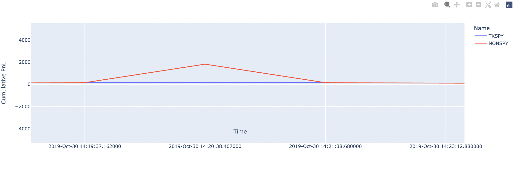
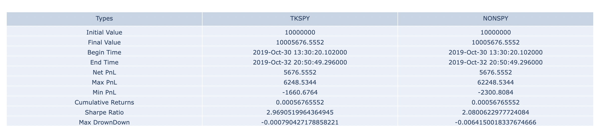
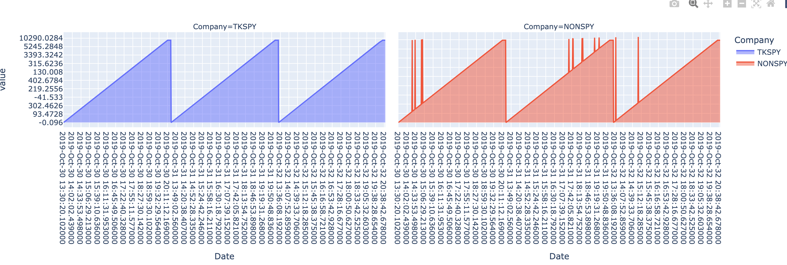

# Backtesting Result Analysis & Visualization

This directory is mainly responsible for displaying the analysis result for the backtesting results generated by the Strategy Studio. 

## Packages

- [Plotly](https://plotly.com/): The backbone of this project is mainly based on the Python Graph Plotting Package Plotly
- Pandas
- Numpy

## Structure Components

The Analysis and Visualization consist of two classes, `StrategyAnalysis` in `visualization.py` and `CompareStrategy` in `Compare.py`

### StrategyAnalysis

- This class is an object for each strategy we implemented, and it requires three parameters: path to the Fill file, path to the Order file, path to the Profit and Loss file. 
- There are several functions user could call for different purposes
- `measureStrategy(print_value = False)`
  - This function returns the evaluation metrics that are helpful for analysis, such as the Final profit, Cumulative Return, Sharpe Ratio, max drown, etc. 
- `visualizePNL()`
  - This function displays two graphs for user to interact with. The user could hover their pointer over the data point on the graph to show the exact value of the Strategy at a specific time. 
  - Box plot is often presented to display finance market per day for analysis. 

### CompareStrategy

- This class is an object used to compare the strategies we add. This object contains a dictionary that maps the name of the strategy to the strategy object we declared earlier. 
- `addStrategy(strategy)`
  - This function add an Strategy object to our dictionary
- `visualizeStrategies()`
  - This function visualizes the strategies we have added to the dictionary, and plot these strategies by each others for the analysts to compare the result. 
  - There is also a time series graph that directly compares the PnL curves of different strategies. 
- `measurementTable()`
  - This function would calculate the evaluation metrics of each strategy, and output the result as a table. 


## Usage

### Example usage

```python
'''Sample program to use Compare and Visualiation classes'''
from Compare import CompareStrategy
from visualization import StrategyAnalysis

# Strategy Object Initialization
my_strategy1 = StrategyAnalysis(
    fill_file=FILL_PATH1,
    order_file=ORDER_PATH1,
    pnl_file=PNL_PATH1,
    initial_value=10000000)

my_strategy2 = StrategyAnalysis(
    fill_file=FILL_PATH_2,
    order_file=ORDER_PATH_2,
    pnl_file=PNL_PATH_2,
    initial_value=10000000)

# Indivdiual Visualization Method
my_strategy1.visualizePNL()
my_strategy2.visualizePNL()

# Strategy Comparision Object
cs = CompareStrategy()
# Adding strategy to the object
cs.addStrategy(my_strategy1)
cs.addStrategy(my_strategy2)

# Visualize the comparsion
cs.visualizeStrategies()
# Output the evaluation metrics
cs.measurementTable()

```

### Example Outputs





