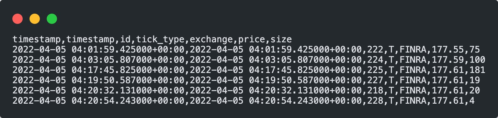
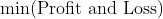
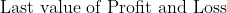
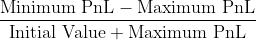

# High Frequency Trading Strategies with RCM Strategy Studio

[[_TOC_]]

**Group 1 FIN 556 High Frequency Trading Final Report**

## People

**Ruipeng (Ray), Han**

- Hello, I am a senior majoring in Math & Computer Science and Statistics at the University of Illinois at Urbana-Champaign. Though my study is wide and highly interdisciplinary, my primary interest is in computer systems, particularly in distributed systems and networks. I also experienced with software engineering from the past four summer interns as a SDE, and my stronggest/favoriate programming languages are Python, Go, and Javascript. I am currently looking for full-time/intern job opportunities in the software development industry as well as applying for graduate schools in Computer Science.
- Feel free to reach me at ruipeng2@illinois or my linkedin profile: linkedin.com/in/ruipenghan


**Yihong, Jian**

- Yihong is a senior studying computer science at University of Illinois, Urbana-Champaign graduating in May 2023. He is passionate about lower level programmings with experince in multiple fields such as networks, distributed systems, and kernels. He has multiple project experiences with C++, such as writing a HDFS from scratch. 

**Tomoyoshi (Tommy), Kimura**

- Tommy is a current Junior in Computer Science at the University of Illinois at Urbana-Champaign. Tommy plans to graduate in his Junior year to pursue a degree in Master of Science in Computer Science. Tommy is passionate about the intersection of Systems and Intelligence, specifically about the system protocols for efficient, scalable, and robust distributed learning. Tommy enjoys learning, and he is interested in Systems engineering, High Frequency Trading, Machine Learning, Front End Development, Backend Development, and Human Computer Interaction.
- Email: tkimura4[at]illinois[dot]edu
- Website: tomoyoshikimura[dot]com
- Linkedin: linkedin[dot]com/in/tomoyoshi-kimura/

**Kaiyuan, Luo**
- TODO


## Introduction

### Project Description

This is a semester-long project for the [FIN 556](https://courses.illinois.edu/schedule/2022/fall/FIN/556) – "Algorithmic Market Microstructure", instructed by Professor [David Lariviere](https://davidl.web.illinois.edu/).

Our project aims to: 

- Develop alogrithmic trading strategies using nano-second accurate data, and
- Generate figures and anlaysize our strategy performance.

We further break down our project into four sections: data retrival and parsing, strategy development, and analysis

1. Data Retrival and Parsing:

   The main market data sources for this project is IEX. We adopted professor Lariviere's IEX data downloader and parser for the project.

2. Strategy Development:

   We use Strategy Studio as the baseground to develop and backtest trading strategies. Strategy Studio is a proprietary software from RCM used for trading strategy developement and testing. Inside Strategy Studio, we create new trading strategies by implementing its interface (for example, inheirting the `Strategy` class). Then, we backtest our strategy in Strategy Studio using the data from the Data Retrival and Parsing section. The backtesting process will create three file (orders, fills, and profit-and-loss) which we can use to evaluate the strategy's performance.

   We focused on developing two strategies. Kalman Filter strategy and Reinforcement Learning based Strategy.

3. Analysis:

   For the analysis part, we implemented interpretation and visualization script for SS backtesting output. We utilized several powerful packages to generate interactive plots for both analysis and comparison. 

### Technologies

#### Programming Languages
- Bash
  - A scripting language that allow users to chain series of commands and feed into computer
  - We write bash scripts for automation works.
- C++
  - Strategy Studio provides the interface entirely in C++ and allow us to implement various strategies in C++. 
- Python
  - We used Python for several tasks dealing with data.
  - We used Python to train deep learning models for ML based strategies.
  - Python is also the major language for result analysis and visualization. We chose Python because there is a very powerful Visualization for financial market data called Plotly. 


#### Softwares

- Strategy Studio
  - We are grateful that **RCM** has sponsored us to give us free access to Strategy Studio for implementing and backtesting our strategies with the market data.

- LibTorch
  - The C++ SDK for PyTorch. We trained models in python and export as a model file. Then we read model file in the C++ strategy code and run predictions.

- Eigen
  - Eigen is an open source C++ linear algebra library that supports the header only KalmanFilter library. Luckly Strategy Studio ships with it so we don't have to manually install it.

- Jupyter Notebook
  - Jupyter Notebook is light weight dev tool for Python and it's commonly used in datascience. We used the tool to train ML models.

#### Development Frameworks

- Virtual Box/Vagrant
  - Virtualbox is a software that is used to create virtual machines
  - Vagrant can use virtualbox to launch standardrized VMs to keep consistency in each run of our project.
  - We used vagrant and virtualbox to set up the environment that runs our project.
  - Our vagrant box contained Software Studio and necessary enviroment. It derived from Prof's Fin566 box.

- Google Colab
  - Colab is a platform hosted by Google
  - We trained models on the platform

- VS Code
  - The de facto text editor that everyone uses
  - We use VS Code to SSH into vagrant to do devs (including writing this report)

#### Opearting Systems
- Ubuntu 20.04

#### Packages

- Strategy Studios Includes

  Strategy Studios contains libraries defined in its software for developing strategies. Please see the stratege studio specifications for detailed documentaions on libraries and interfaces.

- Analysis packages

  ```bash
  plotly
  numpy
  pandas
  kaleido
  ```

**Repository Layout**

```bash
group_01_project
└── analysis
└── docs
└── quant
└── strategies
  ├── kalman_filter_strategy
	  ├── KalmanFilterStrategy.cpp
	  ├── KalmanFilterStrategy.h
    ├── Makfile
    ├── kalman_filter.cpp
    ├── kalman_filter.h

```

## Usage:

To run our compiled demo, follow these steps:
1. Download and install virtual box and vagrant
2. Clone our repo:
```bash
> git clone https://gitlab.engr.illinois.edu/fin556_algo_market_micro_fall_2022/fin556_algo_fall_2022_group_01/group_01_project.git
```
3. Copy strategy into SS sdk
4. Compile
5. Copy ```.so``` file to bt directory
6. Run bt 


### IEX Data parsers

We directly imported the Professor's IEX downloader/parser as a submodule of our project so we can directly use it to download DEEP and TRADE data from IEX exchange that is ready to be feed into Strategy Studio for strategy development and backtesting. The link to Professor's IEX downloader/parser is [here](https://gitlab.engr.illinois.edu/shared_code/iexdownloaderparser). Details on directions of using the IEX downloader/parser can be found on the README.md under the project root directory.

```bash
parser
└── iex_parser
	├── src
	    ├── download_iex_pcaps.py
	    ├── parse_compress_iex_pcaps.py
    	├── parse_iex_caps.py
    	├── stockbook.py
    ├── README.md
    ├── download.sh
    ├── parse_all.sh
    
```

1. Direct to the IexDownloaderParser directory `cd parser/IexDownloaderParser`and run <code>./download.sh</code> to download the source IEX deep data (.gz format). To retrieve data in a specific range of dates, open and edit the download.sh, only modifies the start-date and end-date arguments:

   ```bash
   python3 src/download_iex_pcaps.py --start-date 2022-01-01 --end-date 2022-06-01 --download-dir data/iex_downloads
   ```

   Note that git-submodules need to be pulled separately, detailed instruction for pulling git-submodule can be found [here](https://stackoverflow.com/questions/1030169/easy-way-to-pull-latest-of-all-git-submodules)

2. Check that the downloaded raw IEX DEEP dat files should be stored at `iexdownloaderparsers/data/iex_downlaods/DEEP`

3. Run `./parse_all.sh` to parse IEX deep data. Result will be stored under `iexdownloaderparsers/data/text_tick_data` with the foramt `tick_SYMBOL_YYYYMMDD.txt.gz`.  

   To specify the company symbols, edit the `--symbols` argument in `parse_all.sh`. The default is SPY only. You can add more companys:

   ```bash
   gunzip -d -c $pcap | tcpdump -r - -w - -s 0 | $PYTHON_INTERP src/parse_iex_pcap.py /dev/stdin --symbols SPY,APPL,GOOG,QQQ --trade-date $pcap_date --output-deep-books-too
   ```

4. The parsed data is in `.gz` format. We want to extract it and save it to a `.txt` file which can be feed into Strategy Studio. Run the following command under `iexdownloaderparsers/data/text_tick_data`  ***(please change your symbol and dates accordingly)***:

   ```bash
   gunzip -d -c tick_SPY_20171218.txt.gz | awk -F',' '$4 == "P" {print $0}' > tick_SPY_20171218.txt
   ```

   This command extracts the data and rows where the fourth column is "P", which corresponds to the format of "Depth Update By Price (OrderBook data)" in Strategy Studio. 

   If instead you want to retrive only the trade data, simply change "P" to "T" in the above command, which is following:

   ```bash
   gunzip -d -c tick_SPY_20171218.txt.gz | awk -F',' '$4 == "T" {print $0}' > tick_SPY_20171218.txt
   ```

5. The `tick_SPY_20171218.txt` (*or your custom data file*) is ready to feed in SS.

### Strategy Studio Data Feeds

Strategy Studio offers a great tool for data feed – text tick reader. This allows Strategy Studio to facilitates automated strategy regression testing against pre-canned data scenarios involving common tick types. In this project, we will store these pre-canned data with the specifed naming convention `tick_SYMBOL_YYYYMMDD.txt`. The text reader supports various event types and fields: 

1. **Trades**
2. **Quotes (Best Bid Offer)**
3. Depth Update By Order (OrderBook data)
4. Depth Update By Price (OrderBook data)
5. Order Book Reset
6. Imbalance

For this project, we would mainly focus on two specfic events: **Trades** and **Quotes (BBO)**. 

##### Trades

- Trade data can reveal general trends in world trade, and Strategy Studio provide registration for Trades (and quotes), and we could use the trade data to feed our strategy to test the performance. To sue Trade data, we often implement the function `onTrade` which is called everytime the tick-reader has detected a trade tick. Then, we would use the passed in TradeEventMessage to update our variables, and then decide whether or not we would like to send an order to buy or sell. 

##### Quotes (BBO)

- Quotes, BBO, or Best Bid & Offer provides us the best bid/ask price in the current market. Unlike Trade data, for which the function `onTrade` is specifically called, `onQuote` does not behave the same and is only called when the best new data is updated. In this case, we use the function `onBar` to reach our goal. For strategy studio, on bar allow us to access the tick information within a short amount of period (bar). Everytime, we could access these information to make a trade. 

#### Example CSV Output



------

## Strategy Implementation

### Kalman Filter Strategy

#### Background

- Kalman filter is a common technic for signal processing. It introduces random variances to deduce to potential locations of a projectile. We hope that it could also capture the movements in between trades and profit from it.

#### Implementation

- We built a kalman filter that takes the current tick's price and volume. At each timestamp, we first update the filter with observed values, then ask it the predict the next value. We then make trade actions based on the predicted values. The filter is reset at the end of each day because it should capture only continuous values.

- We also used python program to generate an estimate of the value errors of the stock market. This helps us to tune the parameters for Backtesting.

<p align="center">
  
</p>


#### Results

- We backtested our Kalman Filter Strategy against SPY tick data from January 03 to July 1st. Through our graph analysis, we found some significant jump specifically right before the market begins and right after the market closes. This has resulted in a significant loss as illustrated below. We then used python program to calculate the intra day profit and loss to produce a more accurate graph regarding the strategy performance. 

##### Strategy Studio output

<p align="center">
  
</p>

##### Intra day Profit and Loss

<p align="center">
  
</p>

### Reinforcement Learning Strategy 

#### Background

### Long Short Term Memory based Strategy

#### Background 

- Long Short-Term Memory (LSTM) is a type of recurrent neural network (RNN) that is well-suited to model long-term dependencies in data. RNNs are neural networks that process sequential data, such as text or time series data, by making use of internal memory to remember information from previous time steps. LSTMs are a variant of RNNs that are able to capture long-term dependencies more effectively than traditional RNNs, by using gating mechanisms to control the flow of information in the network.

- We implemented a LSTM model using Python, which is exported as a .pt model then loaded and backtested in Strategy Studio.
In high-frequency trading (HFT), LSTM models can be used to analyze and make predictions based on financial time series data, such as stock prices, volumes, and order flows. HFT firms often use LSTMs to build predictive models that can identify patterns in the data and make trades based on those patterns. In our project, we used LSTM to predict the market price of the given stock for the next trade; if the predicted price is higher, we will initiate a BUY action in StrategyStudio, else, we will sell.

<p align="center">
  
</p>

- The technology involved is:
  * Python and Google Colab: The LSTM model is implemented in Python and trained locally.
  * Strategy Studio: We load the Python-trained model ("lstm.pt") in C++ using LibTorch library (a C++ distribution for Pytorch), and we run inference on the model on each trade callback (`OnTrade()`). The model will yield a result, from which we will leverage to make further decisions.

```math
\mathbf{i}t = \sigma(\mathbf{W}{ix} \mathbf{x}t + \mathbf{W}{ih} \mathbf{h}_{t-1} + \mathbf{b}_i) \\
\mathbf{f}t = \sigma(\mathbf{W}{fx} \mathbf{x}t + \mathbf{W}{fh} \mathbf{h}_{t-1} + \mathbf{b}_f) \\
\mathbf{o}t = \sigma(\mathbf{W}{ox} \mathbf{x}t + \mathbf{W}{oh} \mathbf{h}_{t-1} + \mathbf{b}_o) \\ 
\mathbf{g}t = \tanh(\mathbf{W}{gx} \mathbf{x}t + \mathbf{W}{gh} \mathbf{h}_{t-1} + \mathbf{b}_g) \\
\mathbf{c}_t = \mathbf{f}t \odot \mathbf{c}{t-1} + \mathbf{i}_t \odot \mathbf{g}_t \\
\mathbf{h}_t = \mathbf{o}_t \odot \tanh(\mathbf{c}_t)
```

- where $`\mathbf{i}t`$, $`\mathbf{f}t`$, $`\mathbf{o}t`$, and $`\mathbf{g}t`$ are the input, forget, output, and cell activation gates, respectively; $`\mathbf{c}t`$ is the cell state; $`\mathbf{h}t`$ is the output of the LSTM unit at time $t$; $`\mathbf{x}t`$ is the input at time $t$; $`\mathbf{W}{ix}`$, $`\mathbf{W}{fx}`$, $`\mathbf{W}{ox}`$, and $`\mathbf{W}{gx}`$ are the input-to-input gate, input-to-forget gate, input-to-output gate, and input-to-cell activation gate weight matrices, respectively; $`\mathbf{W}{ih}`$, $`\mathbf{W}{fh}`$, $`\mathbf{W}{oh}`$, and $`\mathbf{W}_{gh}`$ are the hidden-to-input gate, hidden-to-forget gate, hidden-to-output gate, and hidden-to-cell activation gate weight matrices.

#### Implementation

Since Strategy Studio does not have native torch library, we had to figure out a way to install torch library in C++. To implemennt LSTM based strategy, we first trained our LSTM model in Python against SPY data from January to mid May, then using Pytorch built in tool to trace the model. In C++, we then load this model and use this model to inference on the current price to predict the price for the next trade.

##### Python Implementation Details

We trained our model in Python.

**Dataset**
- We are using SPY Jan 03 - May 13 stock market data. There are total of 1266892 data point.
<p align="center">
  
</p>
- Then we use MinMax transform to scale our data into -1 and 1 range for normalization.

```math
x_\text{scaled} = {x - x_\text{min} \over x_\text{max} - x_\text{min}} * (1 - (-1)) + -1
```
- We then splitted our data into training data and testing data. The ratio used is $8:2$. That gives us 1013498 traning data point and 253374 testing data point.

**Loss**
- For the loss, we are using the Mean Squared Error. We trained our model in 100 epoches with hidden dimesion equal to 32
```math
\text{MSE} = {1 \over N} \sum_{i = 1}^{n} (y_i - \tilde{y_i})^2
```
- The resulting loss curve is
<p align="center">
  
</p>

- After training, we have zero for the Training Root Mean Squared Error, and 0.07 for the Testing Root Mean Squared Error.
- Plotting our model performance against the stock market data, we get
<p align="center">
  
</p>
- We can see that the test is higher than expected, this makes sense since the training data used has significantly higher value than the testing dataset. 
- Here is a zoomed in figure on the testing portion.
<p align="center">
  
</p>

##### C++ Strategy Implemetation Details

#### Results

## Analysis

### Interrpetation & Visualization Layout

```
Analysis
	├── compare_strategy.py
	├── main.py
	├── strategy_analysis.py
```

### Interpretation

- There are various metrics that we would like to evaluate on our result. Strategy Studio outputs three files: fills, orders, and PnL (Profit and Loss). For analysis, we would mainly focus on PnL since the net loss is what we care about the most as traders. 

- The PnL file generated is a `.csv` file with three columns: Strategy name, Time, and Cumulative PnL. For interpretation, we would analyze the PnL based on several metrics. 

  - Maximum Profit and Loss

    

  - Minimum Profit and Loss

    

  - Net Profit and Loss

    

  - Cumulative Returns

    

  - Sharpe Ratio

    

  - Max Drowndown

    

### Visualization

- For visualization, we are using the Python package `plotly` to generate various meaningful graphs for evaluation. `plotly` offers powerful interactive figures for users to modify directly. Just like a few of the examples in the previous sections, we could see that there are various types like line, bar, and table like figures that simulates stock market graphs in real finance applications like Yahoo Finance. 
- Plotly is extremely power for interactive visualization. For example, we could see that we could decide which trace of the graph we would like to see, and hide the other one by simply clicking the legend. 

#### Implementation

There are mainly two classes: `StrategyAnalysis` and `CompareStrategy` . We also have a `main.py` file for automation, that is, our DevOps could directly run this program that generates the newest export files, and our program would look for this latest files and execute on these. Then, it would store these files in a new directory for us to access. Beside automation, our implementation also allows interactive modes that give the user control over the exact strategy they would like to compare. User could add as many as they want by Name, Id, and Ticks. At the end of the interactive mode, the program would automatically run the comparison class and generates outputs. 

##### Strategy Analysis

- This class represents a Strategy object. This type of object is initialized with the three files generated from the Strategy Studio and it would use Pandas Dataframe to store each fill, order, and PnL. For each strategy, we also add the corresponding Tick data into it so we could evaluate our strategy with the market data to understand the reasoning behind the rise and the fall of each. 
- Examples could be found in previous sections. 

##### Compare Strategy

- The strategy acts like a container that holds all the Strategy object we mentioned earlier. In this class, we could evaluate the performance of each strategy with each other, and output graph and table for traders to analyze each strategy. The measurement table for Swing between Apple and SPY could be an example, and another example is the evaluation of BLSF Strategy and Swing Strategy on SPY market data. 
  

#### Interpretation & Visualization Usage

- Direct to `analysis` directory (`cd ./analysis`)
- Simply run `python3 main.py` would run visualization by using the latest three files (Fill, Order, and PnL). This will generate figures and store in `./figs/` directory. 
- There is also an interactive version by runing `python3 main.py -i` and follows the promot.
  - Interactive mode would ask you to add strategy by entering the 
    - `Name` of the strategy
    - `ID` of the strategy output if the strategy is ran multiple times
    - `Ticks` of the strategy, or the symbol, for example:`SPY` 
  - When we enter no for adding strategy, the interactive mode would also outputs the **measurement table** with each strategy statistics as a column

## Conclusion & Reflections

### Ruipeng (Ray), Han
1. **What did you specifically do individually for this project?**
- I helpped setting up Pytorch in Strategy Studio environment, this includes retriving libraries (TorchLib, compiling source files, and developing a Pytorch program in C++.
- Helped compiled trading strategies and provided a short simple example cpp executable that succesfully compiles and loads and inference a Pytorch model in Strategy Studio.
- I was responsible for downloading a part of the tick data we use for Backtesting (Jan to Feb 2022).
- I was responsible for taking other member's developed models trained in Python and implement the actual C++ strategy and ran backtesting in Strategy Studio.

2. **What did you learn as a result of doing your project?**
- I learned a lot about Pytorch's C++ distribution: how Pytorch's syntax looks like in C++, how to save and load a Pytorch model in C++, and how it integrates to Strategy Studio's interface.
- I learned developing makefiles, Cmakes, Linux shells, and all kinds of system tasks during my research to load Pytorch model in Strategy Studio.
- I learned how LSTM works for time-series based market data and its pros & cons.
- I learned a lot about how backtesting works in C++, the type of tick feeds used, etc.

3. **If you had a time machine and could go back to the beginning, what would you have done differently?**
- I would definietly try doing RPC to load and run the Pytorch model, instead of spending tons of time (about 2-3 weeks on this) figuring out how to setup TorchLib in C++ locally. Using RPC may costs efficiency becuase it takes much longer time for the call to forward and return, but it would be much easier so I can help others develop the strategies.

4. **If you were to continue working on this project, what would you continue to do to improve it, how, and why?**
- I would continue to tune the parameters of existing LSTM model and run with bigger test set with various ticks (beyond SPY)
- I would implement the RPC for Python model. I can start a Python sever locally, and inside the Strategy.cpp, I will directly pass the arguments (price, quantity, etc) to the local server hosting the Python model.

5. **What advice do you offer to future students taking this course and working on their semester long project. Providing detailed thoughtful advice to future students will be weighed heavily in evaluating your responses.**
- Begin your research early! Setting up the environment can be harder than you thought.

### Yihong, Jian

1. **What did you specifically do individually for this project?**

- I researched on Kalman Filter library and resolved compile time issues.
- I helped resolve KF Strategy OOM issues.
- I resolved compiling and compatibility issue of PyTorch.
- I implemented scratch KF Strategy and barebone PyTorch Strategy.
- I supported LSTM model exporting.
- I ran all backtesting result used in this repo on my computer.

2. **What did you learn as a result of doing your project?**

- Surprisingly, the most I learned was how to compile C++ code. For example, the difference between ```.a``` and ```.so``` files, compilation stage vs. linking stage, and etc.
- I learned that CLRF causes countless issues.
- I learned that a money making strategy is not easy to find. Even though our strategy was promising in the research stage, replicating performance in backtest is not easy.
- I learned that even interpreting output is annoying. We had hard time understanding the jumps in PnL output and had to think of alterantives intepretations.

3. **If you had a time machine and could go back to the beginning, what would you have done differently?**

- Run more backtests. We started backtesting stage a bit too late, so we did not have enough time to fully understand our algo performance.

4. **If you were to continue working on this project, what would you continue to do to improve it, how, and why?**

- I first better interpret our backtest result files, then make adjustment on the strategies accordingly.
- I would run more backtests.
- I would write more robust/more complicated machine learning models, e.g. RL models with state trackers, since they have potentials to work better. 

5. **What advice do you offer to future students taking this course and working on their semester long project. Providing detailed thoughtful advice to future students will be weighed heavily in evaluating your responses.**

- Make sure the environment works. Try to run multiple passes with heavier load. We were inefficient in figuring how we should compile the code, who could run the backtest, what source limitation we had. Try to nail these before starting on the strategies as it will make sure everyone is on the same page.
- Fail early. We are a bit lost in the middle when we sketched out everything. It was no until a later stage when we find out many non-trivial issues like jumps in PnL. We did not have sufficient time to fully understand backtester's behavior. Try to identify these issues early and patch them.

### Tomoyoshi (Tommy), Kimura (Project Leader)

copied from ie498 TOOD change stuff

1. **What did you specifically do individually for this project?**

- I was in charge of creating issues, assigning tasks, setting milestones, and keeping tracks of all the progress in the group.
- I was responsible for downloading a part of the data we use for Backtesting
- I implemented the Kalman Filter strategy, using the backbone Kalman Filter class implemented by Yihong. 
- I implemented LSTM backbone model and trained the model against SPY data from January to May.
- I also helped Ruipeng in integrating LSTM model into Strategy Studio by generating the Traced model path file
- I developed Analysis & Visualization with Python to visualize various metrics for the strategies we implemented, and evaluated potential bug in Strategy Studio such as huge jump in PnL when the market closes
- I outlined the README and report documents for my team to fill in their parts


2. **What did you learn as a result of doing your project?**

- I learned various important concepts for High Frequency Trading and how to develop strategies with other areas such as Kalman Filter and Long Short Term Memory
- I have gained practical experience in developing my own strategy with Kalman Filter, which has been an important concept for time series data and motion data.
- I also had a chance to develop my own model using market data. I learned a lot about Long Short Term Memory and how it can be used to write strategies.
- I also gained experience in converting models implemented in Python into C++. 
- I have gained a solid understanding in the market microstructure, including data feed like Tradec and BBO
- I am more familiar with visualizations with Market data and how to produce meaningful figures for quantitative analysis.

3. **If you had a time machine and could go back to the beginning, what would you have done differently?**

- Do more research on the backbone of the project
- Communicate better with teammates to make sure that every team member is making progress.
- Conducting more tests for strategy implementations
- Start early to ensure that the project can be delivered on time

4. **If you were to continue working on this project, what would you continue to do to improve it, how, and why?**

   If I were to continue working on this project, I would continue working on writing better strategies and more meaningful visualizations. Although we have already implemented different strategies, there are definitely various cases that these strategies are prone to, and there are definitely different features we could implement to improve the performance of the strategy. The current strategy I have implemented takes bold moves and perform well with data that has oscillating behaviors. However, when the market data falls continuously, my strategy does not perform well and loses money, since our assumption is broken in this case. Due to the lack of time, I have yet been able to modify much to generate a satisfying output, but I would love to continue working on it for better performance. Beside this strategy, I feel like I could improve the analysis & visualization program further to reflect on possibilities for improvements of the strategies. The current program would only generate some statistical measurements and general PnL of the strategies with the tick data. However, if the program could show graphs that give feedbacks on how to improve the strategies, the process of writing better strategies will be more efficient and less time-consuming. 

5. **What advice do you offer to future students taking this course and working on their semester long project. Providing detailed thoughtful advice to future students will be weighed heavily in evaluating your responses.**

   The first advice I would give is to negotiate with the teammate well and develop a strong DevOps and project pipeline in the beginning of the semester long project. Having this strong pipeline allows a smoother workflow and improves the project efficiency in many ways. Generating these rules could assure the code quality as well as the project standard in many ways. My second advice would be make sure that the group has a very detailed and structured plan for their project. This would make sure that every team member can keep track of whether what they are doing fit into the project pipeline, and this would reduce lots of error and time-consuming debugging process near the end of the project. Lastly, I would recommend that never hesitate to ask questions to both your team members and the professor. Your peers could often give you new insights to the problems, and you could always learn something from them. Professor Lariviere is very informed in this industry, and he always reply fast and know answers to most of your questions. 

### Kaiyuan, Luo

1. **What did you specifically do individually for this project?**
2. **What did you learn as a result of doing your project?**
3. **If you had a time machine and could go back to the beginning, what would you have done differently?**
4. **If you were to continue working on this project, what would you continue to do to improve it, how, and why?**
5. **What advice do you offer to future students taking this course and working on their semester long project. Providing detailed thoughtful advice to future students will be weighed heavily in evaluating your responses.**


## Reference

1. https://www.cmcmarkets.com/en/trading-guides/trading-strategies
2. https://optionalpha.com/help/backtesting-results-summary
3. https://blog.quantinsti.com/backtesting/
4. https://blog.quantinsti.com/stock-market-data-analysis-python/
5. https://plotly.com/
6. https://www.nasdaqtrader.com/content/technicalsupport/specifications/dataproducts/NQTVITCHspecification.pdf

